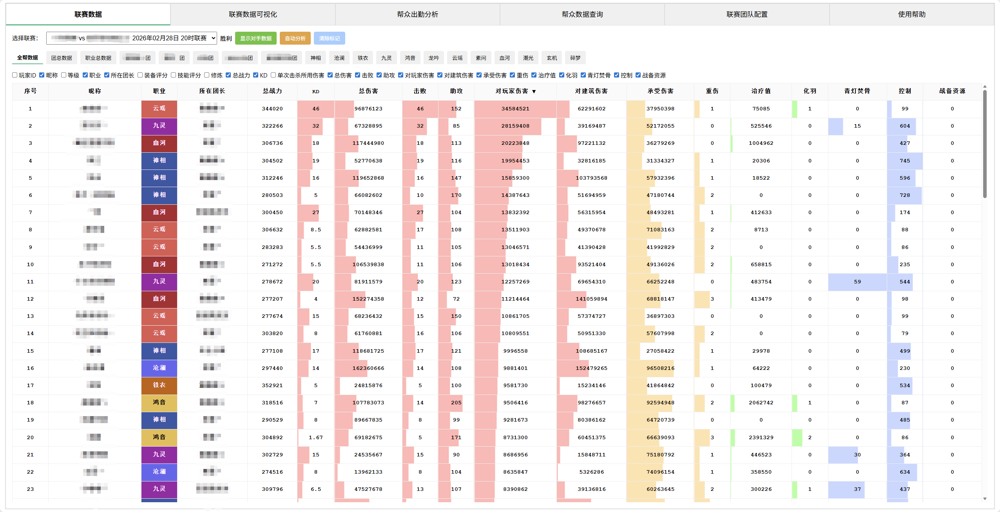
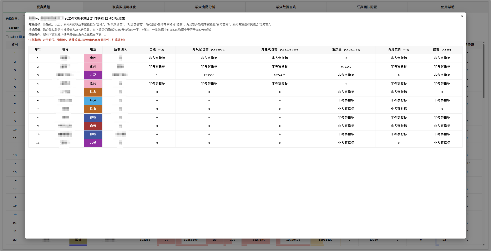
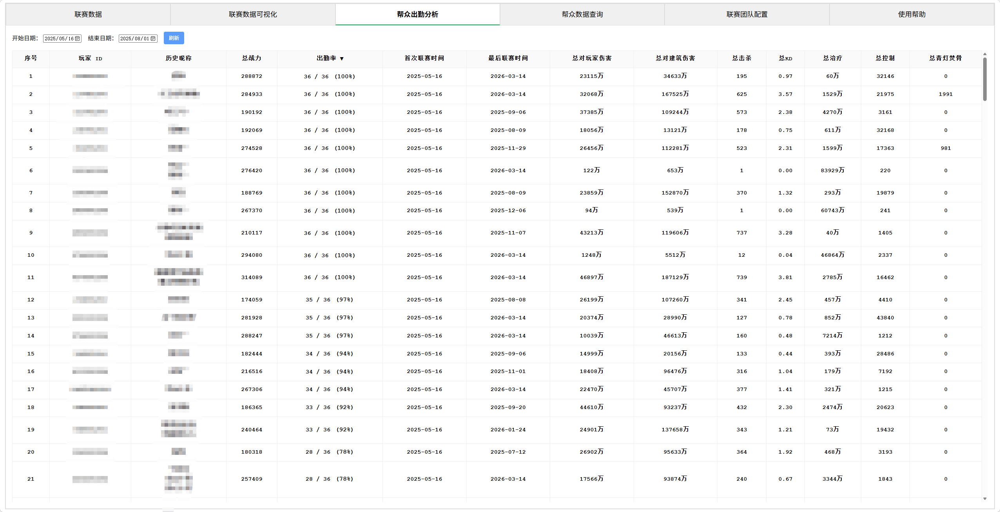
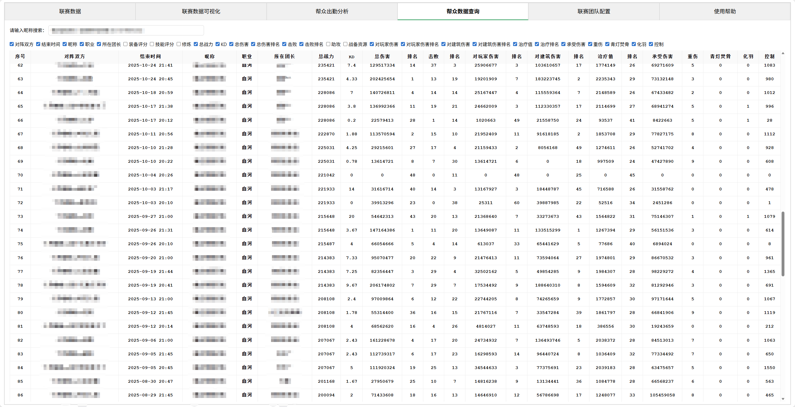
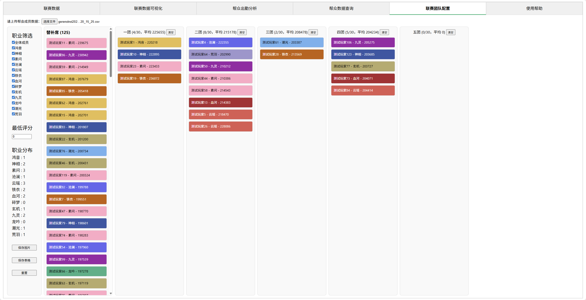

# nsh-match-analytics
逆水寒联赛数据综合管理系统

# 项目简介
nsh-match-analytics 是一个用于管理和分析 **《逆水寒》黄金服端游** 帮会联赛数据的 Web 系统。系统支持导入游戏内导出的联赛 csv 数据，提供数据库管理、数据统计以及网页可视化的展示功能，并附带诸如帮会成员历史数据查询、联赛团队配置等实用工具。
<p>





</p>
主要功能包括：
- “联赛数据”模块可查看每一场联赛所有参与者的战斗数据，包括本帮帮众与对方帮众，显示联赛胜负与额外备注信息，并提供一个简易的数据分析引擎，用于联赛数据分析。。联赛数据通过交互式表格的方式呈现。交互式表格支持如下功能：
  - 可手动勾选控制表格列是否显示；
  - 战斗数据支持数据条可视化；
  - 鼠标左键单击表头可对该列进行排序；
  - 右键单击表头对该列高亮显示；
  - 右键单击序号对该行高亮显示；
  - 右键单击单元格对该单元格高亮显示；
  - 左键单击玩家 ID 或玩家昵称，可查看该玩家参与的所有历史联赛数据。

- “联赛数据可视化”模块通过柱状图的形式对比同一场联赛中不同参与玩家之间的数据。柱状图支持：
  - 按所在团长或所属职业筛选参与玩家；
  - 展示13种不同的联赛数据。

- “帮众出勤分析”模块展示开始日期与结束日期之间，所有玩家的联赛出勤率情况。具体展示如下数据：
  - 玩家最近一次联赛参与时的总战力；
  - 联赛出勤率（不显示出勤次数为0的玩家）；
  - 首次与最后联赛时间；
  - 统计区间内的联赛战斗数据汇总。
  - 鼠标左键单击表头可对该列进行排序；
  - 左键单击玩家 ID 或玩家昵称可查看该玩家参与的所有历史联赛数据。

- “帮众数据查询”模块展示一个帮众的所有历史联赛数据。首先通过搜索框搜索需要展示历史数据的帮众。搜索框支持关键字、拼音、拼音首字母模糊查找。选择需要展示的帮众后，会展示该帮众所有参与的联赛数据。数据表格支持鼠标左键单击表头进行排序。

- “联赛团队配置”模块方便帮会管理配置各团成员名单。加载帮会成员数据后：
  - 所有成员默认出现在替补席，可通过职业和评分筛选替补席成员；
  - 鼠标悬停在替补席成员上可速查该玩家最近三次联赛数据；
  - 鼠标左键可在各团队与替补席间拖动帮会成员；
  - 鼠标悬停在各团顶部名字上可显示团队职业配置；
  - 单击左侧“保存图片”按钮快速将团队配置导出为图片；
  - 单击左侧“保存表格”按钮快速将团队配置导出为电子表格。

# 技术栈
**Frontend:** Vue 3, Vite  
**Backend:** Python, Flask, Gunicorn  
**Database:** SQLite, Pandas  
**Deployment:** Nginx, systemd

# 快速开始
按如下步骤操作即可快速上线。
## 1 数据库
### 1.1 初始化数据库
```
cd database
pip install -r requirements.txt
```
创建数据库：
```
sqlite3 game_league.db < schema.sql
sqlite3 game_league.db < init_data.sql
```

### 1.2 插入本帮帮会名
```
python insert_home_guild.py
``` 
按照提示输入本帮帮会名。 **如果帮会更名，需要重新插入记录。**

### 1.3 导入一场联赛数据
**该部分操作须在具有图形界面的电脑上进行**，涉及图形界面的操作。
```
python insert_match.py
```
在图形界面中依次设置
- 本帮帮会名
- 数据库文件
- 联赛 csv 数据文件
- 帮会成员信息 csv 文件
- 联赛胜负信息与备注

点击“导入”即可。导入过程中会提示输入数据库中缺失的玩家 ID。可在游戏中打开玩家详细信息页面查看。

服务稳定运行后，仅需在每场联赛后运行 `insert_match.py` 导入数据并更新服务器上的数据库文件即可实现数据库的更新。

## 2 后端服务部署
以下步骤适用于 Ubuntu 服务器
### 2.1 系统准备：
```
sudo apt update
sudo apt install -y git curl build-essential
sudo apt install -y python3 python3-venv python3-pip
```

### 2.2 测试运行
```
cd backend
python3 -m venv venv
source venv/bin/activate
pip install -U pip
pip install -r requirements.txt
# 测试运行前，编辑 `config.py` 确保 `Config.DATABASE` 指向正确的数据库文件
python app.py
```
如果成功启动，说明后端运行正常。

### 2.3 使用 Gunicorn 部署
在虚拟环境 venv 中，安装gunicorn
```
pip install gunicorn
# 测试运行
venv/bin/gunicorn --workers 4 --bind 127.0.0.1:5000 app:app
```

### 2.4 使用 systemd 管理服务 
创建服务文件:
```
/etc/systemd/system/nsh_backend.service
```
内容示例：
```
[Unit]
Description=NSH Backend Flask App
After=network.target

[Service]
Group=www-data
WorkingDirectory=/root/nsh-match-analytics/backend
Environment="PATH=/root/nsh-match-analytics/backend/venv/bin"
ExecStart=/root/nsh-match-analytics/backend/venv/bin/gunicorn \
  --workers 4 --bind 127.0.0.1:10290 app:app
Restart=always

[Install]
WantedBy=multi-user.target
```
根据实际路径修改：
- `WorkingDirectory`
- `Environment`
- `ExecStart`

启动服务
```
sudo systemctl daemon-reload
sudo systemctl enable nsh_backend
sudo systemctl start nsh_backend
# 检查状态
sudo systemctl status nsh_backend
```

## 3 前端部署

### 3.1 环境准备

确保服务器已安装 **nginx** 。

### 3.2 构建前端
```
cd frontend
npm install
npm run build
```

### 3.3 复制静态文件到 nginx 目录
```
mkdir -p /var/www/nsh_frontend
cp -r ./dist/* /var/www/nsh_frontend
chown -R www-data:www-data /var/www/nsh_frontend
```

### 3.4 配置nginx
创建配置文件：
```
/etc/nginx/sites-available/nsh_frontend
```
根据实际情况配置。示例配置：
```
server {
    listen 80;
    # 如果有域名请改为你的域名，否则可留成 "_"，表示所有未匹配 server_name
    server_name _;

    auth_basic           "请输入用户名和密码";
    auth_basic_user_file /etc/nginx/.htpasswd;

    root /var/www/nsh_frontend;
    index index.html;

    # 所有对 /api/ 的请求，反代给后端 Flask/Gunicorn
    location /api/ {
        proxy_pass http://127.0.0.1:10290;
        proxy_set_header Host $host;
        proxy_set_header X-Real-IP $remote_addr;
        proxy_set_header X-Forwarded-For $proxy_add_x_forwarded_for;
    }

    # 对于前端路由，所有路径都返回 index.html
    location / {
        try_files $uri $uri/ /index.html;
    }

    # 可选：静态资源 cache-control
    location ~* \.(js|css|png|jpg|jpeg|gif|svg|ico)$ {
        expires 7d;
        add_header Cache-Control "public";
    }
}
```
启用站点
```
sudo ln -sf /etc/nginx/sites-available/nsh_frontend /etc/nginx/sites-enabled/
sudo nginx -t
sudo systemctl reload nginx
# 如有需要可删除默认站点
sudo rm /etc/nginx/sites-enabled/default
```

### 3.5 设置访问密码
```
sudo apt update
sudo apt install apache2-utils
# 创建密码文件
sudo htpasswd -c /etc/nginx/.htpasswd XXX
# 修改用户密码
sudo htpasswd /etc/nginx/.htpasswd XXX
```

# License
本项目采用 MIT License。
