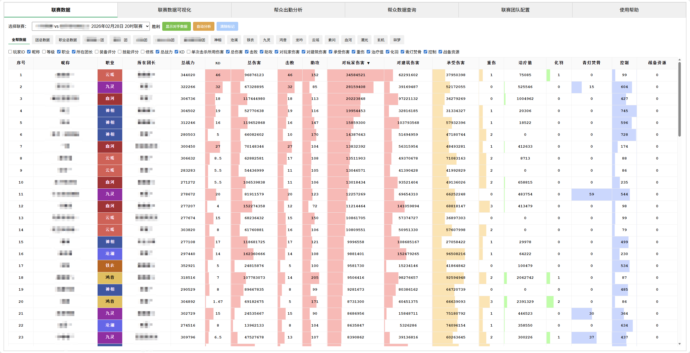
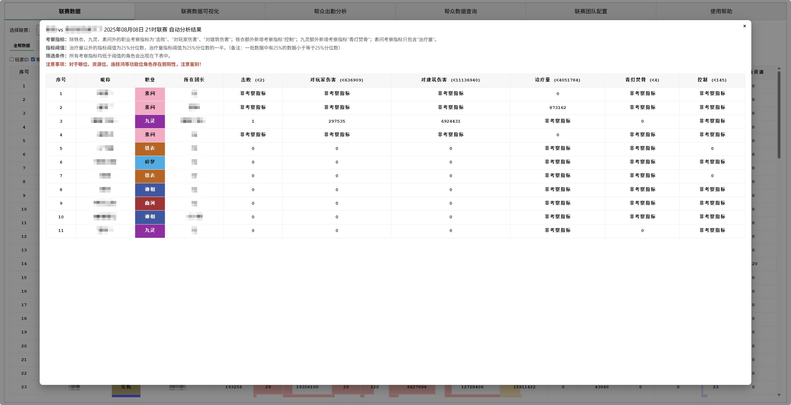
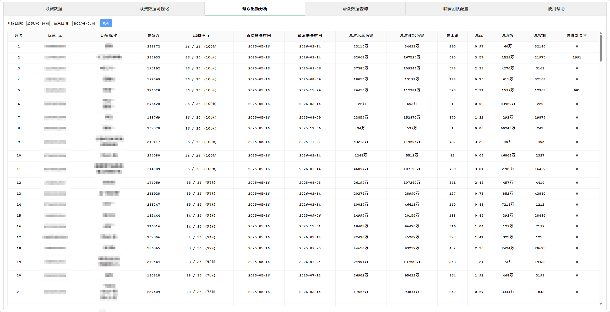
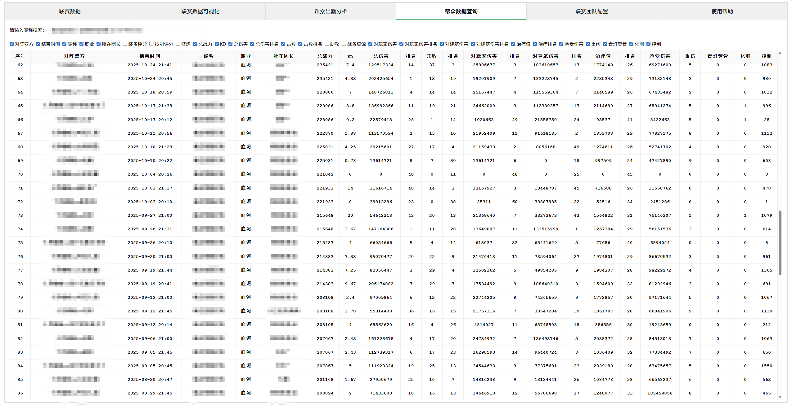
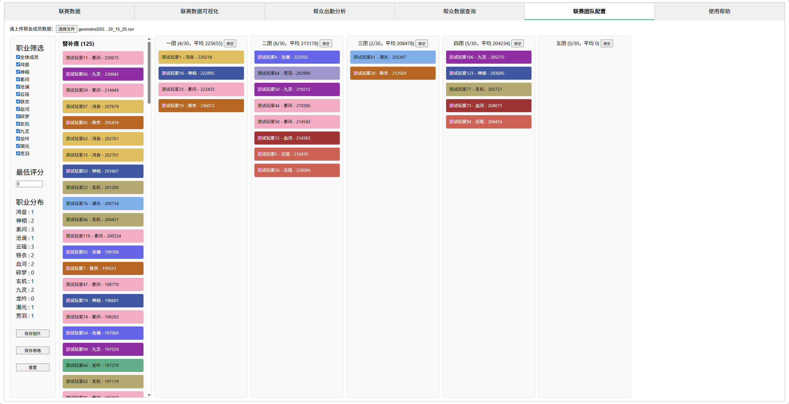

# nsh-match-analytics

《逆水寒》端游帮会联赛数据管理与分析系统，支持经典服和黄金畅玩服联赛数据。

系统使用游戏导出的 CSV 建立 SQLite 联赛数据库，提供比赛记录、对手数据、出勤统计、玩家历史、团队配置，以及带预检、备份和玩家身份确认的管理员网页导入流程。

<p>
  
  
  
  
  
</p>

## 功能

- **联赛数据**：查看本帮和对方战绩、胜负、备注及自动分析结果；支持排序、列显隐、数据条和单元格高亮。
- **帮众出勤分析**：按时间范围统计出勤率、最近战力、首次/最后参赛时间及累计战斗数据。
- **帮众数据查询**：按昵称、拼音或拼音首字母查找玩家，并查看历史表现和单场排名。
- **联赛团队配置**：筛选、拖放和编辑成员职业，查看近期表现，并导出图片或电子表格。
- **管理员网页导入**：上传联赛与成员 CSV，自动识别经典服/黄金畅玩服，预检玩家身份，并在备份后事务写入数据库。

## 技术栈与服务

- 前端：Vue 3、TypeScript、Vite
- 后端：Python、Flask、Gunicorn、Pandas
- 数据库：SQLite
- 生产部署：Nginx、systemd

本地开发需要三个服务进程；生产环境由 Nginx 提供静态文件，只运行两个 Gunicorn 后端：

| 服务 | 默认地址 | 用途 |
| --- | --- | --- |
| Vite 开发服务器 | `http://127.0.0.1:5173` | 本地前端开发 |
| 普通后端 | `http://127.0.0.1:10290` | 查询 API `/api/*` |
| 管理员后端 | `http://127.0.0.1:10291` | 健康检查及写入 API `/admin-api/*` |

生产环境中，浏览器应只访问 Nginx；10290 和 10291 必须保持为本机端口。公网或不可信网络建议为 Nginx 配置 HTTPS。

## 环境要求

- Python 3.9 或更高版本；推荐使用 CI 验证过的 Python 3.11
- Node.js `^20.19.0` 或 `>=22.12.0`
- npm
- SQLite 3 命令行工具

## 本地启动

以下命令均从仓库根目录开始执行。

### 1. 初始化数据库

以下步骤只适用于全新数据库：

```bash
cd database
sqlite3 game_league.db < schema.sql
sqlite3 game_league.db < init_data.sql
python3 insert_home_guild.py
cd ..
```

`insert_home_guild.py` 会提示输入本帮帮会名。管理员页面填写的本帮名称必须与这里录入的名称以及 CSV 中的名称完全一致。如果帮会更名，需要重新运行该脚本添加新名称。

### 2. 安装后端依赖

```bash
cd backend
python3 -m venv venv
source venv/bin/activate
python -m pip install --upgrade pip
pip install -r requirements.txt
cd ..
```

默认配置位于 `backend/config.py`：

```python
class Config:
    DATABASE = "../database/game_league.db"
    ADMIN_UPLOAD_DIR = "./tmpfile/"
    DB_BACKUP_DIR = "./backup/"
```

按本文命令启动时，这些相对路径均落在仓库内。不要让本地开发配置指向生产数据库。

### 3. 启动两个后端

终端一：

```bash
cd backend
venv/bin/gunicorn --workers 1 --bind 127.0.0.1:10290 app:app
```

终端二：

```bash
cd backend
venv/bin/gunicorn --workers 1 --bind 127.0.0.1:10291 admin_app:app
```

管理员后端健康检查：

```bash
curl http://127.0.0.1:10291/admin-api/health
```

正常响应：

```json
{"status":"ok"}
```

### 4. 启动前端

终端三：

```bash
cd frontend
npm ci
npm run dev
```

访问 `http://127.0.0.1:5173`。Vite 会将 `/api` 代理到 10290，将 `/admin-api` 代理到 10291。

生产服务器的安装、HTTP Nginx 示例、权限、备份恢复和排障见 [部署指南](docs/deployment.md)。

## 管理员导入

打开联赛数据页面并点击“导入数据”，或直接访问 `/admin/import`。

每次导入需要：

1. 本帮帮会名。
2. 本帮比赛结果和可选备注。
3. 游戏导出的联赛数据 CSV。
4. 帮会成员 CSV。

前端先识别联赛模式。经典服会直接使用原联赛 CSV 进入后端预检；黄金畅玩服会先让管理员确认真实团长和小队归属，在浏览器内只改写本帮记录的“所在团长”列，再进入同一套后端预检。用户电脑上的原文件不会被修改。

### CSV 通用要求

- 两个文件的扩展名都必须是 `.csv`。
- 使用 UTF-8 或 UTF-8 BOM 编码；当前不会自动识别 GBK/ANSI。
- 两份文件和 multipart 数据合计的单次上传请求最大 16 MiB。
- 表头名称必须与下文完全一致；可以包含系统不使用的额外列。
- 表头不要添加首尾空格；前端识别时会修剪表头，但后端按原始列名精确校验。
- 联赛 CSV 的数值字段不能为空且必须是整数。
- 成员 CSV 的装评、修为、修炼和总战力允许为空，空值按 `0` 处理；成员 CSV 缺少某位本帮玩家时，该玩家的四项成员属性也按 `0` 写入。
- 联赛 CSV 必须同时包含本帮和且仅一个对方帮会。
- 联赛 CSV 文件名必须包含 `YYYY_MM_DD_HH_MM_SS` 格式的比赛时间，例如 `联赛数据_2026_08_18_20_30_00.csv`。
- 文件名中的比赛时间必须严格晚于数据库已有的最新比赛；系统不支持倒序补录或覆盖既有比赛。
- 本帮名和帮会名最长 100 个字符，玩家/团长昵称最长 64 个字符，职业最长 50 个字符；这些字段不能包含尖括号、控制字符或不可见格式字符。

### 联赛数据 CSV

必需列：

```text
帮会名、玩家、等级、职业、所在团长、击败、助攻、战备资源、
对玩家伤害、对建筑伤害、治疗值、承受伤害、重伤、青灯焚骨、化羽、控制
```

最小示例：

```csv
帮会名,玩家,等级,职业,所在团长,击败,助攻,战备资源,对玩家伤害,对建筑伤害,治疗值,承受伤害,重伤,青灯焚骨,化羽,控制
本帮名称,玩家甲,80,血河,玩家甲,5,10,100,200000,30000,0,150000,2,0,0,3
对方名称,玩家乙,80,铁衣,对方团长,2,8,90,120000,20000,0,210000,4,0,0,5
```

### 帮会成员 CSV

经典服导入必需列：

```text
名称、装评、修为、修炼、总战力
```

黄金畅玩服还必须包含 `分堂` 和 `职位`。因此，一份同时兼容两种模式的成员 CSV 至少应包含：

```csv
名称,分堂,职位,装评,修为,修炼,总战力
玩家甲,青龙堂,青龙堂主,100000,20000,30000,150000
```

黄金畅玩服要求至少存在一个以“堂”结尾的有效分堂，且成员昵称不能重复。多个职位使用中文或英文分号分隔，例如 `青龙堂主；管理`。

### 模式识别规则

模式识别只统计本帮行。计算团长数量和每团人数时排除“所在团长”为“无”的玩家，但这些玩家仍会正常预检和导入：

- 任一“所在团长”名下至少有 7 人时，识别为经典服。
- 否则，不同“所在团长”不超过 6 个时，识别为经典服。
- 其他情况识别为黄金畅玩服。

页面会展示判定依据和每个原“所在团长”对应的人数。管理员应在继续前确认识别结果符合实际数据。

### 黄金畅玩服团长与小队规则

可选团长必须是本场本帮参赛玩家，并且原“所在团长”不能为“无”。系统按以下顺序生成默认结果，所有结果都应由管理员复核：

1. 对每个分堂，优先推荐成员 CSV 拆分后的职位项精确包含“`分堂名`主”的可选团长。
2. 成员表中存在该堂堂主，但这些堂主都不是本场可选团长时，才回退为推荐该堂符合条件的参赛玩家中总战力唯一最高者。
3. 成员表中完全没有该堂堂主、多名参赛堂主同时符合条件、总战力并列、战力无效或没有候选人时，不自动推荐，由管理员配置。
4. 至少配置一名团长；每名团长只能对应一个分堂，每个分堂也只能对应一名团长，但不要求所有分堂都配置团长。
5. 原小队中包含一名已配置团长时，整个小队自动归属该团长；包含多名已配置团长时必须修正配置。
6. 不包含已配置团长的小队，如果至少 4 名成员属于同一分堂，则尝试归属该分堂团长。
7. 人数少于 4、没有分堂共识或对应分堂未配置团长的小队，需要管理员从已配置团长中手动选择真实团长。
8. 每名团长最多分配 5 个原小队；限制的是小队数，不是玩家数。
9. 原“所在团长”为“无”的玩家保持不变。

确认后，前端只改写本帮行的“所在团长”；对方数据保持原样。

### 后端预检与玩家 ID

后端预检会验证文件结构、整数、帮会、职业、比赛时间和数据库状态，并显示本帮/对方记录数。本帮必须预先存在于数据库；对方帮会不存在时会自动创建；双方所有职业名都必须与数据库职业表精确匹配。

以下昵称需要管理员确认玩家 ID：

- 在比赛时间点找不到有效昵称记录。
- 距该玩家上次参赛超过 29 天。

确认范围包括本帮参赛玩家及其“所在团长”，不包括对方玩家。

长期未参赛玩家会预填原 ID；确认仍为同一玩家时保留原值，否则输入新的游戏玩家 ID。玩家 ID 必须是 `2` 到 `9223372036854775807` 范围内的 ASCII 纯数字。

预检记录有效期为 1 小时。预检后如果系统检测到比赛记录版本发生变化，提交会被拒绝；提交时还会重新检查帮会、职业、昵称和比赛顺序。遇到预检失效时必须重新上传并预检。

### 提交与数据安全

最终提交时，管理员后端会：

1. 重新读取暂存 CSV 并再次校验。
2. 获取 SQLite 写锁并核对预检时的比赛记录版本。
3. 在 `DB_BACKUP_DIR` 创建导入前数据库备份。
4. 在一个事务中写入比赛、胜负、双方战绩和昵称历史。
5. 发生错误时回滚事务；成功后删除本次暂存文件。

备份失败会阻止导入。备份恢复、保留策略和排障见 [部署指南](docs/deployment.md#备份与恢复)。

## 质量检查

前端：

```bash
cd frontend
npm run lint
npm run type-check
npm run build
```

后端基础检查：

```bash
cd backend
venv/bin/python -m compileall .
venv/bin/python -c "import app"
venv/bin/python -c "import admin_app"
```

CI 还会使用 Ruff 检查 `backend/` 和 `database/`，并重新创建数据库以验证 SQL 文件。

## 项目目录

```text
backend/                 Flask 普通 API、管理员 API 和后端配置
database/                SQLite schema、初始化数据和本帮帮会脚本
frontend/                Vue 前端
docs/deployment.md       生产部署、更新、恢复和排障
docs/images/             README 截图资源
```

## License

本项目采用 [MIT License](LICENSE)。
