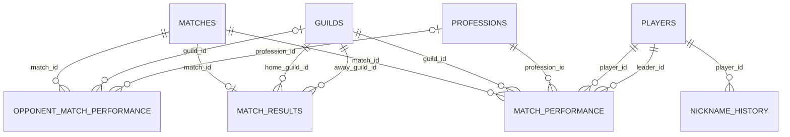

# 系统架构与数据边界

本文面向维护者和部署者，说明 nsh-match-analytics 的运行边界、主要数据流、数据模型和当前实现约束。普通操作见[用户指南](user-guide.md)，写入流程见[管理员导入指南](admin-import.md)，生产安装与恢复见[部署指南](deployment.md)，HTTP 契约见[API 文档](api.md)。

## 1. 系统定位与范围

nsh-match-analytics 使用游戏导出的联赛 CSV 建立一份 SQLite 联赛档案，并提供：

- 本帮与对手的单场战绩、胜负、备注和敌我统计对比；
- 按本帮分团数据在浏览器中生成并下载团队战报 PNG；
- 本帮玩家出勤、历史表现、改名历史和团队配置；
- 经典服联赛与黄金畅玩服联赛的管理员网页导入；
- 导入前预检、玩家身份确认、数据库备份和事务写入。

一份数据库表示**一个逻辑本帮的连续历史**。同一帮会更名时，可以按[部署指南的登记流程](deployment.md#已有生产库登记更名后的本帮名称)保留多个本帮名称；系统不是多租户平台，不应把多个互不相关的本帮混入同一数据库。比赛顺序、出勤分母、玩家列表和最新比赛时间都是全库口径。

## 2. 运行组件与端口

| 组件 | 开发环境默认地址 | 生产职责 | 主要代码 |
| --- | --- | --- | --- |
| Vue 单页前端 | `127.0.0.1:5173` | 由 Nginx 提供静态文件 | `frontend/src/` |
| 查询后端 | `127.0.0.1:10290` | 处理 `/api/*` 只读查询 | `backend/app.py` |
| 管理员后端 | `127.0.0.1:10291` | 处理 `/admin-api/*` 预检与写入 | `backend/admin_app.py` |
| SQLite | 无网络端口 | 保存联赛、玩家、昵称和战绩 | `database/schema.sql` |
| 上传暂存目录 | 无 | 保存预检期间的两份 CSV 和元数据 | `Config.ADMIN_UPLOAD_DIR` |
| 备份目录 | 无 | 保存每次最终导入前的数据库备份 | `Config.DB_BACKUP_DIR` |

前端通过相对路径访问 API。开发时 Vite 将 `/api` 转发到 10290，将 `/admin-api` 转发到 10291；生产时由 Nginx 完成同样的反向代理。

生产拓扑如下：

```text
浏览器
  │ HTTP Basic Auth；不可信网络必须叠加 HTTPS
  ▼
Nginx :80/:443
  ├── 静态文件和 SPA fallback ─────────────────────────────> Vue
  ├── /api/* ─────────────> 127.0.0.1:10290 ─> app.py ──────────────────┐
  └── /admin-api/* ───────> 127.0.0.1:10291 ─> admin_app.py ─┬──────────┴─> SQLite
                                                            ├─> 上传暂存目录
                                                            └─> 备份目录
```

10290 和 10291 只应监听 loopback。生产 systemd 示例让查询后端使用多个 worker，让管理员后端保持单 worker；后者可减少同一进程内清理暂存、创建秒级文件名备份和串行写入之间的竞争。

## 3. 前端边界

前端入口是 `frontend/src/main.ts`，路由定义在 `frontend/src/router/index.ts`。主要页面包括：

- `/match`：联赛明细、团/职业聚合、对手数据、敌我对比和自动分析；
- `/attendance`：区间出勤和累计战斗数据；
- `/player-history`：按昵称、拼音或拼音首字母查找本帮玩家历史；
- `/match-configurator`：读取成员 CSV，在浏览器中完成分团和导出；
- `/help`：站内帮助；
- `/admin/import`：管理员导入流程。

`frontend/src/api/nsh.ts` 和 `frontend/src/api/admin.ts` 是当前前端的 API 类型与调用封装。联赛汇总、敌我对比、自动分析阈值、经典服联赛/黄金畅玩服联赛识别以及黄金畅玩服联赛的团长与小队推断都在浏览器中计算，服务端不保存这些界面状态。

团队配置页还会把成员、分组和已加载的近期历史写入浏览器 `localStorage`。缓存键为 `nsh-match-configurator-cache/v1`，进入新一周后会删除上一周缓存。这些数据不会由该功能写回服务器。

### 3.1 团队战报导出

团队战报位于 `frontend/src/features/match-report/`，职责分为两层：

- `buildMatchReport.ts` 只做数据校验、标准化、分团、排序、过滤和统计最大值计算，不访问浏览器 API，也不修改页面持有的原始数组或对象；
- `generateMatchReportImage.ts` 使用浏览器原生 Canvas 2D API 生成 PNG。第一遍在临时 Canvas 上测量文字、备注换行和完整布局，第二遍创建精确尺寸的输出 Canvas，绘制标题、表头、单元格、数据条、网格和文字；
- `constants.ts` 和 `types.ts` 统一定义固定导出列、四张表、绘图样式、布局参数和 Canvas 安全上限。

导出入口只使用联赛页已经加载的本帮战绩、比赛结果和备注。即使页面当前切换到对手视图，传入报告模块的仍是 `homePerformances`，不会把对手行混入图片；导出动作本身也不会再请求一套专用报告数据。报告按团长分组，正常团队按参赛人数降序排列，“未分团”置底；每个团队固定生成“对玩家伤害表”“对建筑伤害表”“击杀数表”和“治疗量表”。

图片使用代码内固定的 18 个导出列，不跟随页面表格的列显隐、当前排序或高亮状态。前三张表排除素问并分别按对玩家伤害、对建筑伤害、击败降序，治疗表只保留素问并按治疗值降序；空表仍会绘制并说明该团没有对应数据。各表的数据条最大值独立计算，因此条长只适合在同一张表内比较。

图片在浏览器内编码为 PNG `Blob`，再由联赛页创建临时对象 URL 触发本地下载。该功能没有新增 HTTP API，不会把图片上传或保存到服务器，也不会写入 SQLite。

报告宽度固定，图片高度根据团队数、每张表的行数和备注换行动态计算。当前代码拒绝生成宽度超过 8192 像素、高度超过 32767 像素或总面积超过 8000 万像素的 Canvas；这些只是应用层安全上限，不代表所有浏览器和设备都能达到。浏览器还可能有更低的单边尺寸或内存限制，尤其是移动设备；大场次的超长图在绘制和 PNG 编码期间会占用较多内存，可能生成失败，因此生产验收应使用目标桌面浏览器测试实际最大场次。

## 4. 读取数据流

普通读取链路如下：

```text
Vue 页面
  │ fetch('/api/...')
  ▼
Vite 或 Nginx
  ▼
backend/app.py
  │ 每次请求建立 sqlite3 连接并执行直接 SQL
  ▼
SQLite
  │ JSON
  ▼
Vue 页面内排序、筛选、缓存、聚合或可视化
```

几个重要口径：

- 本帮战绩来自 `match_performance`；对手战绩来自 `opponent_match_performance`，两者通过不同接口读取。
- 敌我统计对比和自动分析由前端计算，不是数据库中的持久化结果。
- 出勤区间内的战斗合计按所选日期过滤，但最近战力、首次参赛和最后参赛取全库范围。
- 玩家选择列表在同一 `player_id` 内按昵称最近一次出现时间从新到旧排列，只返回最近三个不重复昵称。
- 出勤接口在同一 `player_id` 内合并重复昵称，按每个昵称首次出现时间从旧到新连接全部不重复昵称。
- 按玩家 ID 查看历史时，排名范围是本帮全场；团队配置页按昵称获取近期历史时，排名范围是当场同一团长名下。

## 5. 管理员导入与两阶段写入

整体流程包含浏览器准备；后端写入协议再分为预检（preview）和提交（commit）两个阶段。

### 5.1 浏览器准备

1. 管理员选择联赛 CSV、成员 CSV、本帮名称、胜负和可选备注。
2. 浏览器只统计本帮行，并根据原“所在团长”的数量和每组人数识别经典服联赛或黄金畅玩服联赛。
3. 经典服联赛直接把原联赛 CSV 交给后端预检。
4. 黄金畅玩服联赛读取成员 CSV 的分堂、职位和总战力，在浏览器内推荐真实团长并推断原小队归属。
5. 管理员确认后，浏览器只改写本帮行的“所在团长”；对方行和用户磁盘上的原文件保持不变。

经典服联赛/黄金畅玩服联赛识别、堂主推荐、分堂共识和“每名团长最多五个原小队”等规则位于 `frontend/src/features/admin-import/adaptiveImport.ts`。这些规则属于**前端辅助与约束**：管理员后端接收的是普通联赛 CSV，不知道其原始模式，也不会重新执行黄金畅玩服联赛的小队推断。直接调用管理 API 的客户端必须自行遵守相同规则。

### 5.2 预检：`POST /admin-api/import/preview`

管理员后端执行以下工作：

1. 将两份 CSV 保存到 `ADMIN_UPLOAD_DIR/<随机令牌>/`；
2. 校验扩展名、必需列、文本、整数、本帮/对手数量和文件名时间戳；
3. 校验本帮是否已存在、职业是否已初始化、比赛是否重复且时间晚于全库最新比赛；
4. 收集本帮参赛玩家及其团长中需要确认的玩家 ID；
5. 记录数据库修订摘要并返回有效期一小时的预检令牌。

修订摘要目前仅由比赛总数、最新 `match_id` 和最新 `match_time` 组成。它能发现正常导入造成的比赛集合变化，但不是数据库全部内容的哈希；提交阶段仍会重新读取文件并重新校验关键数据库状态。

### 5.3 提交：`POST /admin-api/import/commit`

最终提交执行：

1. 读取预检令牌对应的暂存文件和元数据；
2. 使用 `BEGIN IMMEDIATE` 获取 SQLite 写锁；
3. 比较预检时和当前的数据库修订摘要；
4. 重新校验文件、比赛顺序、本帮、职业和昵称，并验证管理员提交的玩家 ID；
5. 使用 SQLite Online Backup API 在 `DB_BACKUP_DIR` 创建导入前备份；
6. 在一个数据库事务中写入对手帮会、比赛、胜负/备注、本帮身份与战绩、对手战绩快照；
7. 成功时提交事务并删除本次暂存目录；失败时回滚数据库事务。

备份文件不属于业务事务。如果备份已经创建、后续写入失败，数据库会回滚，但该备份文件可能保留。预检失败和提交成功会立即清理对应暂存目录；被放弃的预检在后续 preview/commit 请求到来时惰性清理。

### 5.4 合服身份边界

`database/server_merge.py` 是一次性的**离线管理写入者**，不是 HTTP 接口、常驻进程或管理员后端的一部分，因此不加入常驻运行拓扑。这里的“合服”不是合并两个 SQLite 数据库，也不会合并帮会、玩家或比赛数据；它只在当前数据库中建立一个本帮昵称身份时间线边界。

边界处理流程如下：

1. 脚本把输入的合服日期解释为当天 `12:00:00`；该时间与比赛时间、昵称有效期一样是无时区时间。
2. 脚本按自己的配置规则解析数据库路径，打开 SQLite 后使用 `BEGIN IMMEDIATE` 获取写锁。
3. 全库最新比赛时间必须严格早于合服边界；任一非哨兵开放昵称的 `valid_from` 也必须早于边界，否则取消处理。
4. 校验通过后，脚本只更新 `nickname_history`：把所有 `valid_to IS NULL` 且 `player_id <> 0` 的记录在边界时间封口。`player_id = 0`、昵称“无”的无团长哨兵保持开放。
5. 全部更新在同一事务中提交，任一错误都会回滚。脚本不会修改 `players`、`guilds`、`matches`、战绩或比赛结果表，也不会迁移既有历史。

边界之后，第一场新比赛的预检会把除“无”以外、尚未重建有效期的昵称视为 `not_found`，由管理员重新确认合服后实际使用的游戏玩家 ID。实际 ID 与旧 ID 相同时，后续导入会在同一 `player_id` 下建立新的同名有效期；因此 `nickname_history` 允许同一玩家的同一昵称出现在多个不同时间段，查询接口展示昵称时会在单个 `player_id` 内去重。实际 ID 已变化时，旧比赛仍属于旧 `player_id`，新比赛属于新 `player_id`；系统不会为了保持连续而自动把两段历史合并或迁移。

对每个普通玩家而言，从边界封口到某次后续导入为其建立首条新有效期之前存在“当前昵称空窗”：按当前昵称查询近期历史会返回空数组，但 `/api/players` 仍可列出已有玩家的历史昵称，按 `/api/player_history/{player_id}` 查询的既有 ID 历史也不受影响。

预检修订摘要只包含比赛数量、最新 `match_id` 和最新 `match_time`，不覆盖 `nickname_history` 变化。因此在合服边界前生成的预检不能仅依赖修订摘要识别身份变化；合服处理后应废弃旧预检并重新上传预检，提交阶段也会重新读取和校验当前昵称状态。离线脚本不经过管理员导入的备份流程；事务只保证出错时回滚，不能恢复已成功提交的错误边界。完整备份、执行和验证流程见[部署指南的“合服边界处理”](deployment.md#合服边界处理)。

## 6. 八表数据模型



| 表 | 作用 | 关键约束与语义 |
| --- | --- | --- |
| `guilds` | 帮会字典 | `guild_id` 主键；名称唯一性目前依赖应用约定，数据库未声明 `UNIQUE` |
| `players` | 本帮稳定玩家身份 | 游戏玩家 ID 作为主键；网页导入允许 `2..9223372036854775807` |
| `nickname_history` | 玩家昵称有效期 | `(player_id, valid_from)` 主键；`valid_from <= 比赛时间 < valid_to` 表示当时有效；同一玩家的同一昵称可在不同时间段重复出现 |
| `professions` | 职业字典 | 导入双方职业都必须精确匹配；初始值来自 `database/init_data.sql` |
| `matches` | 比赛主记录 | 保存规范化 `match_name` 和无时区 `match_time` |
| `match_performance` | 本帮玩家单场战绩 | `(match_id, player_id)` 主键；保存稳定玩家/团长 ID、当场昵称、职业、战斗及成员属性 |
| `match_results` | 对阵与本帮结果 | schema 允许每场零或一条；受支持的网页导入会写入一条，保存本帮、对手、`win/lose/null` 和备注 |
| `opponent_match_performance` | 对手单场快照 | 保存昵称、团长昵称和战斗数据，不建立对手 `player_id` 或昵称历史 |

初始化数据还定义两个哨兵：

- `player_id = 0`、昵称“无”：表示没有团长；
- `guild_id = 10000`、帮会“无”：帮会 ID 空间的占位记录。

`database/init_data.sql` 和 `database/insert_home_guild.py` 约定小于 10000 的 guild ID 用于本帮名称，大于 10000 的 ID 用于对手。该分区是应用约定，不是 schema 的 `CHECK` 约束，管理员后端也没有再次检查目标帮会 ID 所在区间。

管理员后端和离线合服脚本的连接都会启用 `PRAGMA foreign_keys = ON`；自行使用 SQLite CLI 或其他脚本写库时也必须显式启用外键检查。查询连接只执行读取，没有启用该 pragma。

## 7. 核心不变量

### 7.1 单一逻辑本帮

- 一份数据库服务一个逻辑本帮的连续历史；帮会更名必须先安全登记新名称，不支持多个独立租户。
- 玩家、昵称、比赛列表和出勤统计都是全库集合。
- `matches` 本身不携带租户键；本帮/对手关系记录在 `match_results` 中。

### 7.2 全局时间线

- 比赛时间从联赛 CSV 文件名中的第一个 `YYYY_MM_DD_HH_MM_SS` 片段提取。
- 新比赛必须严格晚于全库已有的最新比赛。
- 当前导入流程不支持倒序补录、覆盖、编辑或删除既有比赛。
- 时间顺序保证昵称有效期和“距上次参赛天数”的计算可按追加模型运行。

### 7.3 本帮身份与对手快照

- 本帮使用稳定 `player_id`，并通过 `nickname_history` 追踪改名。
- 对手没有稳定身份，不能从对手行进入玩家历史，也没有装备、修为、修炼和总战力。
- 本帮团长保存为 `leader_id`；对手团长只保存当场文本 `leader_nick`。

### 7.4 写入原子性

- 管理员最终导入的业务数据在一个 SQLite 事务中写入，失败时回滚；提交前必须成功创建数据库备份。
- 管理员后端通过预检修订摘要和 `BEGIN IMMEDIATE` 防止两个正常导入在过期预检基础上同时提交。
- 离线合服脚本另行使用 `BEGIN IMMEDIATE` 和回滚保证自身更新的原子性，但不经过管理员导入的自动备份流程；执行前备份与验证必须遵循[部署指南的“合服边界处理”](deployment.md#合服边界处理)。

## 8. 配置与路径解析

默认配置位于 `backend/config.py`：

```python
class Config:
    DATABASE = "../database/game_league.db"
    ADMIN_UPLOAD_DIR = "./tmpfile/"
    DB_BACKUP_DIR = "./backup/"
```

离线合服脚本另外使用 `database/config.py`：

```python
class Config:
    DATABASE = "./game_league.db"
```

路径解析存在三种需要特别注意的规则：

- `backend/app.py` 直接把 `Config.DATABASE` 交给 `sqlite3.connect`，相对路径按进程当前工作目录解释；
- `backend/admin_app.py` 会把数据库、暂存和备份的相对路径解析为相对于 `backend/` 的绝对路径；
- `database/server_merge.py` 使用 `database/config.py`，并把相对数据库路径解析为相对于脚本所在的 `database/` 目录的绝对路径，不受调用者当前工作目录影响。

因此开发命令应先进入 `backend/`，生产配置应使用绝对路径，并保证两个后端与离线脚本最终指向同一数据库。错误的工作目录可能让查询后端静默创建一份空 SQLite 文件。生产执行合服处理时不应修改受 Git 跟踪的 `database/config.py`，而应按[部署指南的“合服边界处理”](deployment.md#合服边界处理)在运行时把 `Config.DATABASE` 显式覆盖为经核对的生产库绝对路径。

前端目前还有构建期硬编码：

- `frontend/src/components/AdminImport.vue` 中的默认本帮名称；
- `frontend/src/components/AppFooter.vue` 中的页脚名称、备案文本和仓库链接；
- `frontend/index.html` 中的页面标题，以及 `frontend/public/favicon.ico`。

部署其他帮会前应核对这些值并重新构建前端。它们尚不能通过运行时环境变量配置；完整操作清单见[部署指南的“构建前定制”](deployment.md#61-构建前定制)。

## 9. 时间语义

- CSV 文件名中的比赛时间、数据库中的 `TIMESTAMP` 和昵称有效期都是**无时区时间**。
- 离线合服脚本把输入的合服日期固定解释为当天 `12:00:00`，并以这个无时区正午时间作为昵称身份边界。
- 系统按中国游戏场景解释这些时间；按昵称查询近期历史时，查询后端使用 SQLite `datetime('now', '+8 hours')` 判断“当前有效”昵称。
- 自动备份文件名使用服务器本地时间，因此生产服务器应明确配置时区，并建议使用 `Asia/Shanghai`。
- 前端部分日期显示使用浏览器本地时区；用户设备时区不同可能导致日期边界显示差异。

当前没有统一的带时区时间模型。跨时区部署或对外提供 API 时，应优先把存储和接口迁移到明确的 ISO 8601 时区语义。

## 10. 安全边界

- 两个 Flask 应用均没有应用层账号、会话或权限模型。
- 查询后端启用了宽松 CORS；管理员后端依赖同源代理，但认证仍完全由外层 Nginx 提供。
- 生产环境必须把 10290 和 10291 限制在 loopback，并分别在 Nginx 为查询 API/普通页面和管理员页面/API 配置访问控制。
- HTTP Basic Auth 不加密凭据；公网、公共 Wi-Fi 或其他不可信网络必须使用 HTTPS。
- 管理员上传的 CSV 含昵称和成员属性。暂存目录应为运行用户私有，不能由 Nginx 静态提供。
- 数据库及备份同样包含玩家 ID、昵称和战斗数据，应纳入访问控制、保留和异地备份策略。
- `/admin-api/health` 只证明进程能返回 JSON，不检查数据库、暂存目录、备份目录或写入能力；不能单独作为 readiness 判断。

完整 Nginx、systemd、权限、备份与恢复示例见 [部署指南](deployment.md)。
